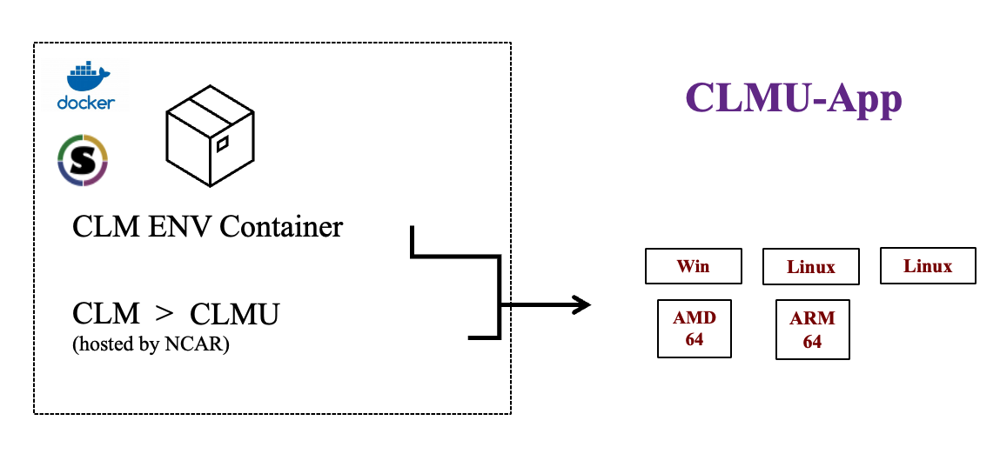

# 📝 Projects 

obswx

[obswx: A Python package for accessing observational meteorological data](https://envdes.github.io/obswx/) \\
**Junjie Yu**, Yuan Sun, Haofan Wang, Zhiyi Song, David Topping, Zhonghua Zheng

    

- [UK historical monthly weather data](https://envdes.github.io/obswx/map.html)
- [HadISD station data](https://envdes.github.io/obswx/map.html)
- [NOAA ISD station](https://envdes.github.io/obswx/map.html)

CLMU-App

[CLMU-App: Enabling Operating System Independent Urban Climate Simulations](https://envdes.github.io/clmu-app/container/intro.html) \\
**Junjie Yu**, Zhonghua Zheng, Yuan Sun, Keith Oleson

   

- CLMU-App supports AMD64 and ARM64 platforms.
- Key features:
  - single point case for urban climate simulations.
  - urban climate exploration, e.g., test urban parameter sensitivity
  - test code locally before an expensive simulation

